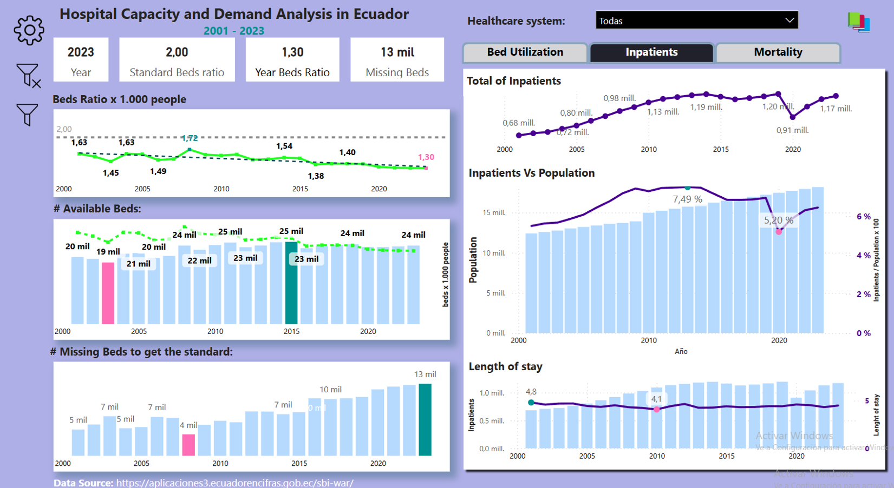

# PowerBI Analysis of the Beds' Capacity in Ecuador.

🌍 Ecuador's Healthcare System: A Growing Challenge (with colorblind theme) 🏥

Some time ago, It was suggested that an appropriate standard for Ecuador was 2 beds per 1.000 inhabitants (WHO's standard suggesting 2.5 to 4 hospital beds per 1,000 inhabitants). 
Without debating the exact figure, I embarked on a journey to collect data on 🛏️ hospital bed availability, 📊 population estimates, and other critical metrics.

💡 From this data, I created a dashboard allowing users to select their preferred standard and assess the bed deficit based on that benchmark.

📊 Key Insights:
Deficit:
By 2023, Ecuador faced a shortage of nearly 13,000 beds (based on a 2 beds per 1,000 inhabitants standard).
Occupancy Rate: Current bed occupancy is at 65%, far from the optimal 80-85% range.

The healthcare system needs strategic reforms to address resource management and improve efficiency.

⚠️ The Bigger Picture: It’s not just about meeting a standard—efficient resource use and promoting a culture of prevention is key to tackling future challenges. 🏥📉
📈 Future Outlook: Hospitalization demand is rising and expected to exceed 1.2 million patients, reflecting an urgent need for more beds and better resource management.
🚀 Ecuador’s healthcare system must adapt by increasing availability, improving resource management, and embracing preventive healthcare measures to build resilience for the future.
🔗 Explore more insights with this interactive dashboard and join the conversation on Ecuador's healthcare challenges!

You can consult the full report:
https://lnkd.in/evqfaUf4

