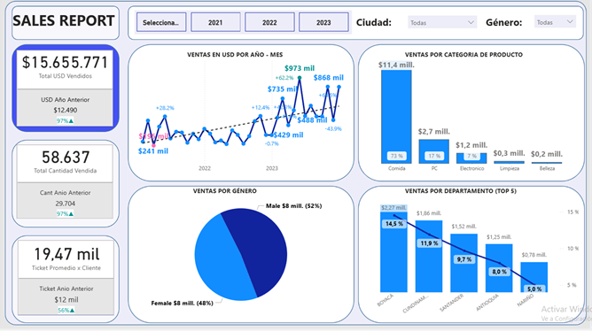
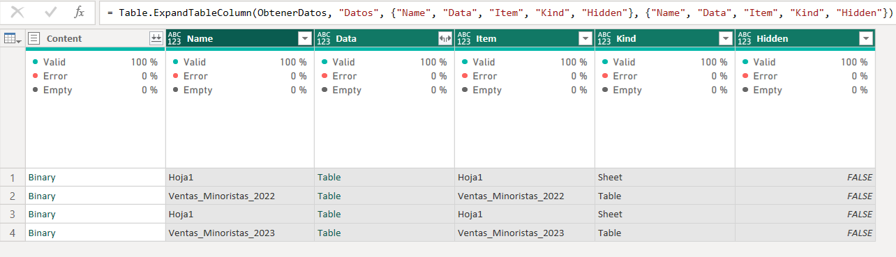

## Ejemplo de Tablero de Ventas:

DashBoard de Ventas - 1ra Parte:

Tablero de Ventas que se conecta a Folder con archivos Excel, datos ficticios.
En esta primera parte, se presenta lo siguiente:

1.- Etiquetas de las principales medidas: ventas comparadas con el año anterior indicando la tendencia. Cantidad de productos vendidos confrontando con el año anterior y el ticket promedio por cliente comparandolo con el año anterior.
2.- Gráfico de línea para observar la tendencia de las ventas, mostrando el valor mínmo y máximo según el rango de datos seleccionados.
3.- Gráfico de distribución de las ventas según la categoría de productos vendidos.
4.- Distribución porcentual de las ventas según el género.
5.-  El top 5 Ventas por Departamento / Ciudades.

Highlights del projecto y tips:

1.- Los archivos de Ventas conectados a una carpeta. Elegir siempre la mejor opción es "Transformar Data".
2.- Para obtener la data de los archivos se procede de la siguiente manera:
    a.- Eliminar las todas las columnas menos Content.
    b.- Crear una nueva columna con Custom Column y nombrarla como Datos.
    c.- Escribir el siguiente código de lenguaje M:
        Excel.Workbook([Content])

3.- Crear la tabla Calendario. Usar lenguaje M para esta tarea, lenguaje Dax o en caso de tener tabla en base de datos concetarse a la misma.

4.- Desarrollo del diseño en papel de lo que s eiba a mostar, esto nos da una pauta de se va a diseñar.

5.- Crear las medidas necesarias para obtener los totales de ventas actuales y del año pasado, de las cantidades compradas, del ticket promedio y de las usadas para dar los formatos deseados.

6.- Crear los gráficos a usar e implementar el diseño del tablero icnluyendo el diseño de tablero y los colores a usar como plantilla.

7.- A continuación se indica el link donde se encuentra esta primera parte de la entrega:

https://app.powerbi.com/view?r=eyJrIjoiOTczYjcxYjYtNTllMS00ZmZjLWFjZDItZTJhNjFjZjc1MjAxIiwidCI6ImI3YWY4Y2FmLTgzZDgtNDY0NC04NWFlLTMxN2M1NDUyMjNjMSIsImMiOjR9

